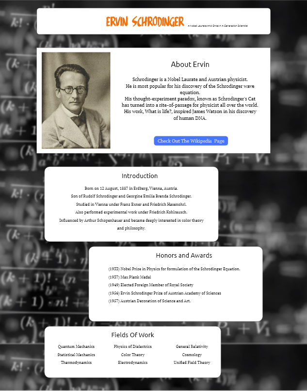

# Tribute Page Ervin Schrodinger

This repository contains source code for a tribute page dedicated to ***Ervin Schrodinger***.
I designed this page as one of the projects for the course Responsive Web Design from FreeCodeCamp.

# Technologies Used

This projects mostly uses HTML and CSS. I have also made use of Bootstrap for adding mobile friendly responsiveness.

# Design

The page was first designed using Adobe XD. This design was later converted to a web page. No plugins for automating this task have been used.

### Web Design

### Mobile Design

The page has been hosted on repl.it and can be found <a href = "https://tributepage-ervinschrodinger.ashish1123.repl.co/"> here</a>.
